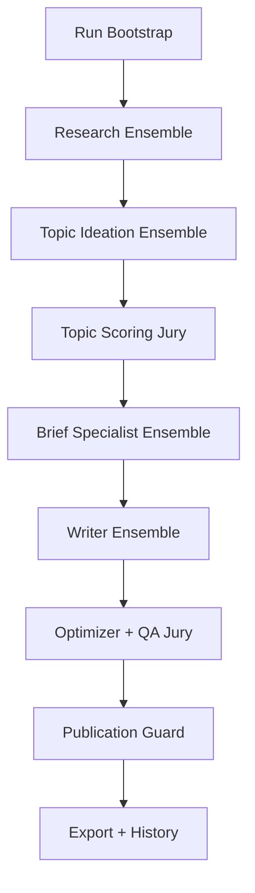

# Ensemble Pipeline Blueprint

This document turns the high-level multi-agent plan into an implementation-ready blueprint for the current Macroscope SEO engine codebase.

It is intentionally mapped to the existing repository shape:

- `/Users/zaid/Documents/Playground/macroscope-seo-engine/app/orchestrator.py`
- `/Users/zaid/Documents/Playground/macroscope-seo-engine/app/providers.py`
- `/Users/zaid/Documents/Playground/macroscope-seo-engine/app/openai_providers.py`
- `/Users/zaid/Documents/Playground/macroscope-seo-engine/app/schemas.py`
- `/Users/zaid/Documents/Playground/macroscope-seo-engine/app/storage.py`
- `/Users/zaid/Documents/Playground/macroscope-seo-engine/app/prompts.py`
- `/Users/zaid/Documents/Playground/macroscope-seo-engine/app/config.py`

The goal is not "more agents for the sake of it." The goal is:

- higher technical credibility for engineers
- lower bias through independent specialist subagents
- stricter anti-hallucination guardrails
- explicit context isolation on every run
- retryable quality gates with hard stop conditions

## 1. Current System Snapshot

Today the pipeline is a single linear flow:

1. `collect_signals`
2. `generate_topics`
3. `score_topics`
4. `build_brief`
5. `write_draft`
6. `qa_optimize`
7. `export`
8. `persist_history`

The existing architecture is already a good base because it has:

- a single orchestrator
- typed schemas
- provider interfaces
- run-scoped artifact persistence
- OpenAI-backed providers with web search support

The current weakness is that most decision points are still single-pass and single-agent:

- one research output
- one topic ideation pass
- one scoring path
- one brief builder
- one writer
- one optimizer
- one QA scorer

That leaves too much room for:

- source blind spots
- style or judgment bias
- shallow technical framing
- over-reliance on one prompt trajectory

## 2. Target Architecture

The target shape is:



Core rules:

- all subagent calls are stateless
- stage outputs are artifacts, not memory
- independent subagents do not share hidden context
- aggregation is explicit and inspectable
- retries are bounded
- low-quality runs can fail

## 3. Non-Negotiable Guardrails

### 3.1 Context Isolation

Every subagent invocation must be fresh.

Implementation rules:

- never use `previous_response_id`
- never keep provider conversation threads across stages
- never pass hidden scratch memory between agents
- only pass explicit structured artifacts from the current run
- do not let one subagent consume another subagent's hidden reasoning

Required code changes:

- add a `RunContext` artifact at the start of every run
- add a helper in a new module `app/guardrails.py` to assert stateless requests
- make `app/openai_providers.py` wrap every request in a stateless request builder

### 3.2 Source Coverage

Engineering articles must not be based on thin marketing content.

Every research packet should include source coverage across these classes when relevant:

- official docs and release notes
- engineering blogs
- community discussion
- market/product announcements
- search-intent or SERP evidence
- benchmarks, papers, or evaluations for deep technical topics

At least one source should come from a primary technical source.

### 3.3 Hard Quality Gates

The final article cannot publish unless:

- average jury score is at least `9.0 / 10`
- no single final expert judge scores below `8.0 / 10`
- technical accuracy score is at least `9.0 / 10`

Retry caps must exist to avoid endless loops.

## 4. New Execution Model

## 4.1 Stage 0: Run Bootstrap

Add a new stage before `collect_signals`.

Purpose:

- create run-scoped execution policy
- snapshot config for this run
- define subagent registry and roles
- guarantee context isolation

New schema:

- `RunContext`
  - `run_id`
  - `run_started_at`
  - `provider_mode`
  - `config_snapshot`
  - `quality_policy`
  - `source_policy`
  - `agent_manifest`

Artifacts:

- `run_context.json`
- `quality_policy.json`
- `source_policy.json`
- `agent_manifest.json`

Code ownership:

- orchestrated in `/Users/zaid/Documents/Playground/macroscope-seo-engine/app/orchestrator.py`
- persistence helpers in `/Users/zaid/Documents/Playground/macroscope-seo-engine/app/storage.py`
- policy definitions in new modules:
  - `/Users/zaid/Documents/Playground/macroscope-seo-engine/app/guardrails.py`
  - `/Users/zaid/Documents/Playground/macroscope-seo-engine/app/agent_specs.py`
  - `/Users/zaid/Documents/Playground/macroscope-seo-engine/app/source_policy.py`

## 4.2 Stage 1: Research Ensemble

Replace the single research step with independent source scouts.

Subagents:

- `hn_scout`
  - Hacker News, Show HN, launch/discussion signal
- `reddit_scout`
  - subreddits relevant to engineering workflows
- `blog_scout`
  - engineering blogs, vendor blogs, changelogs
- `docs_scout`
  - official documentation, product docs, release notes
- `paper_scout`
  - papers, benchmarks, arXiv, evaluations when topic depth requires it
- `social_scout`
  - public X/Twitter only if accessible and useful

Each scout returns:

- source list
- extracted claims
- tagged themes
- source class
- freshness
- technical-depth estimate

Follow-up subagents:

- `research_normalizer`
  - dedupes and canonicalizes sources
- `technical_verifier`
  - downgrades shallow or unsupported signals
- `source_coverage_judge`
  - checks whether required source classes were covered

If `source_coverage_judge` fails:

- rerun missing scouts only
- max retries: `1`

New schemas:

- `ResearchSource`
- `ResearchClaim`
- `ResearchPacket`
- `SourceCoverageReport`
- `TechnicalSourceAssessment`

New artifacts:

- `research/raw/hn_scout.json`
- `research/raw/reddit_scout.json`
- `research/raw/blog_scout.json`
- `research/raw/docs_scout.json`
- `research/raw/paper_scout.json`
- `research/raw/social_scout.json`
- `research/normalized_signals.json`
- `research/source_coverage_report.json`
- `research/technical_source_report.json`

Provider changes:

- keep existing `MarketSignalProvider`
- add ensemble execution in a new coordinator rather than bloating the provider interface
- create a new helper module:
  - `/Users/zaid/Documents/Playground/macroscope-seo-engine/app/ensemble.py`

Recommended implementation shape:

- `MarketSignalProvider.collect()` remains the low-level fetch/generation entrypoint
- `ResearchEnsembleRunner` in `app/ensemble.py` coordinates multiple prompt variants and multiple source scopes

## 4.3 Stage 2: Topic Ideation Ensemble

Replace one topic researcher with multiple independent ideators.

Subagents:

- `market_gap_researcher`
  - topic opportunities from competitor and SERP gaps
- `engineering_pain_researcher`
  - real developer pain points from practitioner discussion
- `technical_depth_researcher`
  - complex technical angles engineers respect
- `freshness_hook_researcher`
  - timely launches, releases, debates, benchmarks
- `commercial_intent_researcher`
  - evaluation and purchase-adjacent queries

Each ideator returns candidates with:

- topic title
- slug
- cluster
- angle summary
- keywords
- evidence references
- why now

Follow-up subagents:

- `topic_synthesizer`
  - dedupes, merges, and normalizes candidates
- `topic_novelty_guard`
  - checks archive overlap, genericity, and reuse policy

New schemas:

- `TopicIdea`
- `TopicIdeaBatch`
- `TopicEvidenceLink`
- `TopicNoveltyReport`

Artifacts:

- `topics/raw/market_gap_researcher.json`
- `topics/raw/engineering_pain_researcher.json`
- `topics/raw/technical_depth_researcher.json`
- `topics/raw/freshness_hook_researcher.json`
- `topics/raw/commercial_intent_researcher.json`
- `topics/topic_pool.json`
- `topics/topic_novelty_report.json`

## 4.4 Stage 3: Topic Scoring Jury

Replace one scorer with a multi-judge panel.

Judges:

- `seo_opportunity_judge`
- `technical_authority_judge`
- `freshness_relevance_judge`
- `commercial_value_judge`
- `originality_judge`

Each judge scores independently on a `0-10` scale and returns:

- numeric score
- rationale
- risk notes
- pass or concern flags

Aggregation:

- average all judge scores
- compute variance
- flag high disagreement

Tie-break:

- `consensus_resolver_judge` only if variance exceeds threshold

Selection rules:

- exact recent duplicate: hard reject
- near-duplicate within cooldown: soft penalty
- previously shortlisted but unpublished: still eligible

New schemas:

- `JudgeScore`
- `TopicJudgeScorecard`
- `TopicConsensusResult`
- `ScoreVarianceReport`

Artifacts:

- `scoring/topic_scorecards.json`
- `scoring/topic_consensus.json`
- `scoring/selected_topic.json`

Implementation note:

The current `/Users/zaid/Documents/Playground/macroscope-seo-engine/app/scoring.py` can stay as the deterministic scoring utility layer, but it should become:

- archive similarity
- cooldown penalty logic
- variance and consensus math
- deterministic tie-break helpers

The LLM scoring personas should move to a new `app/judges.py`.

## 4.5 Stage 4: Brief Specialist Ensemble

Break brief generation into specialist subagents.

Subagents:

- `outline_architect`
- `entity_researcher`
- `faq_builder`
- `internal_link_planner`
- `claims_risk_reviewer`

Then:

- `brief_synthesizer`
- `brief_qa_judge`

The `brief_qa_judge` must ensure:

- outline is sufficiently technical
- sections are not generic filler
- FAQs are answer-engine friendly
- risky claims are called out
- internal links are plausible and useful

Retry:

- rebuild only weak sections
- max retries: `1`

New schemas:

- `BriefComponent`
- `BriefAssembly`
- `BriefQualityReport`

Artifacts:

- `brief/outline_architect.json`
- `brief/entity_researcher.json`
- `brief/faq_builder.json`
- `brief/internal_link_planner.json`
- `brief/claims_risk_reviewer.json`
- `brief/research_brief.json`
- `brief/brief_quality_report.json`

## 4.6 Stage 5: Writer Ensemble

Instead of one writer, create multiple independent full-draft writers.

Writers:

- `technical_writer`
  - precise, engineering-first
- `pragmatic_writer`
  - workflow and implementation focused
- `analytical_writer`
  - comparison and benchmark heavy
- optional `contrarian_writer`
  - tradeoff-heavy and skeptical

Each writer sees:

- the same brief
- the same run policy
- no other writer output

Each writer returns:

- markdown article
- short self-reported focus summary

Artifacts:

- `drafts/technical_writer.md`
- `drafts/pragmatic_writer.md`
- `drafts/analytical_writer.md`
- `drafts/contrarian_writer.md`

New schemas:

- `DraftVariant`
- `DraftSelectionInput`
- `DraftSelectionResult`

## 4.7 Stage 6: Draft Evaluation and Optimizer Jury

Each writer draft is evaluated independently before a winner is chosen.

Evaluators:

- `technical_accuracy_judge`
- `seo_judge`
- `aeo_judge`
- `clarity_judge`
- `evidence_completeness_judge`

Selection rule:

- choose highest weighted average
- if scores are close, break ties on technical accuracy first

After selecting a draft, run optimizer passes:

- `seo_optimizer`
- `aeo_optimizer`
- `clarity_optimizer`
- `technical_accuracy_optimizer`

Final jury:

- `snippet_judge`
- `onpage_judge`
- `intent_match_judge`
- `structure_judge`
- `internal_linking_judge`
- `technical_accuracy_judge_final`

Final acceptance criteria:

- average score >= `9.0`
- no judge < `8.0`
- technical accuracy >= `9.0`

Retry loop:

- max optimization rounds: `2`
- if final gate still fails, mark run failed

New schemas:

- `DraftJudgeScorecard`
- `OptimizerPassResult`
- `FinalQualityGate`

Artifacts:

- `drafts/draft_scorecards.json`
- `drafts/selected_draft.json`
- `optimization/pass_1.md`
- `optimization/pass_2.md`
- `optimization/final_quality_gate.json`

Implementation note:

The current `/Users/zaid/Documents/Playground/macroscope-seo-engine/app/qa.py` should remain the deterministic local heuristic layer. It should not be removed. Instead:

- use it as one signal inside the broader ensemble
- add new higher-level LLM-judge orchestration around it

## 4.8 Stage 7: Publication Guard

Before export, run a final blocker stage:

- `publication_guard`

Checks:

- title and slug alignment
- meta description alignment
- no leftover scaffolding
- headings are sane
- no unsupported strong claims
- internal links present
- FAQ section present

If it fails:

- one repair pass
- else abort export

Artifact:

- `publication_guard.json`

## 4.9 Stage 8: Export and History

Export stays similar, but history logic must change.

Current issue:

- `topic_history.json` acts too much like a permanent deny-list

New model:

- store publication history separately from topic candidate memory
- allow good unpublished or long-cooled topics to return later

New files:

- `/Users/zaid/Documents/Playground/macroscope-seo-engine/data/topic_history.json`
- `/Users/zaid/Documents/Playground/macroscope-seo-engine/data/topic_cooldowns.json`
- `/Users/zaid/Documents/Playground/macroscope-seo-engine/data/topic_shortlist_history.json`

New schemas:

- `PublishedTopicRecord`
- `TopicCooldownRecord`
- `TopicShortlistRecord`

Rules:

- exact published slug within cooldown window: reject
- near-duplicate angle within cooldown: penalize
- shortlisted but unpublished topics: eligible later
- same topic can re-enter if cooldown expired or market changed materially

## 5. Module Plan

## 5.1 New Modules

Add these modules:

- `/Users/zaid/Documents/Playground/macroscope-seo-engine/app/ensemble.py`
  - common ensemble runner patterns
  - fan-out, collect, aggregate, retry

- `/Users/zaid/Documents/Playground/macroscope-seo-engine/app/guardrails.py`
  - stateless-call enforcement
  - retry budgets
  - quality policies
  - run context assertions

- `/Users/zaid/Documents/Playground/macroscope-seo-engine/app/judges.py`
  - topic judges
  - draft judges
  - final jury aggregation

- `/Users/zaid/Documents/Playground/macroscope-seo-engine/app/source_policy.py`
  - source requirements and trust scoring

- `/Users/zaid/Documents/Playground/macroscope-seo-engine/app/history.py`
  - cooldown logic
  - shortlist reuse logic
  - duplicate handling

- `/Users/zaid/Documents/Playground/macroscope-seo-engine/app/agent_specs.py`
  - canonical subagent names, roles, and prompt metadata

## 5.2 Existing Modules to Refactor

### `/Users/zaid/Documents/Playground/macroscope-seo-engine/app/orchestrator.py`

Refactor from a single linear agent runner into:

- top-level stage coordinator
- stage-specific ensemble runners
- stage retry handling
- explicit artifact naming per subagent
- failure gating

### `/Users/zaid/Documents/Playground/macroscope-seo-engine/app/openai_providers.py`

Add:

- stateless agent-call helpers
- role-specific structured-output helpers
- common source-domain filters when required
- explicit per-agent request metadata

Do not let this module become the orchestrator.

### `/Users/zaid/Documents/Playground/macroscope-seo-engine/app/providers.py`

Keep provider interfaces small and stable.

Avoid creating one interface per subagent. Instead:

- keep high-level provider primitives
- move ensemble composition to `app/ensemble.py`

### `/Users/zaid/Documents/Playground/macroscope-seo-engine/app/prompts.py`

Split into prompt builders by stage and persona:

- `research_prompts.py`
- `topic_prompts.py`
- `brief_prompts.py`
- `writer_prompts.py`
- `judge_prompts.py`

This can start as one file, but the target shape should be split modules.

### `/Users/zaid/Documents/Playground/macroscope-seo-engine/app/schemas.py`

This file is already central. It should gain new models, but the final result will likely be too large for one file.

Recommended eventual split:

- `schemas/core.py`
- `schemas/research.py`
- `schemas/topics.py`
- `schemas/briefs.py`
- `schemas/drafts.py`
- `schemas/judging.py`
- `schemas/history.py`

### `/Users/zaid/Documents/Playground/macroscope-seo-engine/app/storage.py`

Add support for:

- nested artifact directories
- topic cooldown persistence
- shortlist history
- run context snapshots

## 6. Provider and Prompt Contracts

Each subagent call should use the same envelope shape internally:

- `agent_name`
- `stage_name`
- `run_id`
- `input_artifact_paths`
- `output_schema_name`
- `system_role`
- `task_prompt`
- `web_search_enabled`
- `allowed_source_classes`

This does not need to be the public provider interface. It can be an internal execution contract enforced by `app/ensemble.py`.

Prompt design rules:

- every prompt explicitly says the agent has no memory beyond supplied inputs
- every prompt lists allowed evidence sources for that role
- judges must score from first principles, not defer to prior judges
- no prompt should include another agent's hidden chain of thought

## 7. Retry and Failure Policy

Use bounded retries only.

Recommended budgets:

- research ensemble coverage retry: `1`
- topic ideation retry: `0` initially
- topic scoring tie-break retry: `1`
- brief weak-section rebuild: `1`
- draft optimization loops: `2`
- publication repair loop: `1`

Failure behavior:

- if research coverage fails twice, fail run
- if no topic passes minimum consensus threshold, fail run
- if no draft meets technical accuracy floor, fail run
- if final quality gate stays below threshold after retries, fail run

This is preferable to silently shipping weak output.

## 8. Numeric Policy

Recommended thresholds for the first implementation:

### Topic Stage

- minimum consensus topic score: `7.2 / 10`
- technical authority score floor: `7.5 / 10`
- originality floor: `6.5 / 10`

### Brief Stage

- brief quality score floor: `8.0 / 10`

### Draft Selection Stage

- technical accuracy floor: `8.5 / 10`
- SEO floor: `8.0 / 10`
- evidence completeness floor: `8.0 / 10`

### Final Publish Gate

- average jury score: `9.0 / 10`
- no single judge below `8.0 / 10`
- technical accuracy: `9.0 / 10`

## 9. Suggested Artifact Layout

Target run directory shape:

```text
data/runs/<run_id>/
  run_context.json
  quality_policy.json
  source_policy.json
  research/
    raw/
      hn_scout.json
      reddit_scout.json
      blog_scout.json
      docs_scout.json
      paper_scout.json
      social_scout.json
    normalized_signals.json
    source_coverage_report.json
    technical_source_report.json
  topics/
    raw/
      market_gap_researcher.json
      engineering_pain_researcher.json
      technical_depth_researcher.json
      freshness_hook_researcher.json
      commercial_intent_researcher.json
    topic_pool.json
    topic_novelty_report.json
  scoring/
    topic_scorecards.json
    topic_consensus.json
    selected_topic.json
  brief/
    outline_architect.json
    entity_researcher.json
    faq_builder.json
    internal_link_planner.json
    claims_risk_reviewer.json
    research_brief.json
    brief_quality_report.json
  drafts/
    technical_writer.md
    pragmatic_writer.md
    analytical_writer.md
    contrarian_writer.md
    draft_scorecards.json
    selected_draft.json
  optimization/
    pass_1.md
    pass_2.md
    final_quality_gate.json
  publication_guard.json
  final.md
  run_summary.json
  events.jsonl
```

## 10. Test Plan

Add tests in phases.

### New Test Files

- `/Users/zaid/Documents/Playground/macroscope-seo-engine/tests/test_guardrails.py`
- `/Users/zaid/Documents/Playground/macroscope-seo-engine/tests/test_history.py`
- `/Users/zaid/Documents/Playground/macroscope-seo-engine/tests/test_judges.py`
- `/Users/zaid/Documents/Playground/macroscope-seo-engine/tests/test_ensemble.py`

### Critical Assertions

- provider calls remain stateless
- cooldown logic allows reused topics after expiry
- unpublished shortlisted topics are still eligible
- research coverage fails when source diversity is too weak
- final gate fails if any judge drops below the floor
- optimization retries stop at cap
- run artifacts are isolated by run ID

## 11. Rollout Plan

Implement this in phases, not in one giant refactor.

### Phase 1: Isolation and History

- add `RunContext`
- add `guardrails.py`
- add `history.py`
- replace permanent archive rejection with cooldown logic

### Phase 2: Topic Scoring Jury

- add `judges.py`
- convert single topic scoring into multi-judge scoring
- add consensus and disagreement handling

### Phase 3: Research Ensemble

- add source scouts
- add coverage and technical-source judges
- persist research subartifacts

### Phase 4: Brief Specialists

- split brief building into specialist subagents
- add brief QA

### Phase 5: Writer Ensemble

- add independent writers
- add pre-selection draft scoring

### Phase 6: Final Optimizer Jury

- add final SEO/AEO/technical jury
- add retry loops with hard gates

### Phase 7: Publication Guard

- final blocker before export

## 12. Immediate Build Order

If implementation starts now, the recommended order is:

1. `RunContext`, `guardrails.py`, and stateless call enforcement
2. `history.py` with cooldown and shortlist memory
3. topic scoring jury and consensus logic
4. research ensemble with source coverage reporting
5. writer ensemble with draft selection
6. final optimizer jury and publish gate

This order gives the best quality gain without destabilizing the entire pipeline at once.

## 13. Definition of Done

The redesign is successful when all of the following are true:

- every run is reproducible from artifacts alone
- no agent depends on hidden prior context
- research packets show explicit source diversity and technical credibility
- topic selection is made by multiple independent judges
- multiple writers compete on the same brief
- the final article only publishes after passing a jury-based quality gate
- second-best topics can return later under cooldown rules
- failed quality runs stop instead of quietly exporting weak content

